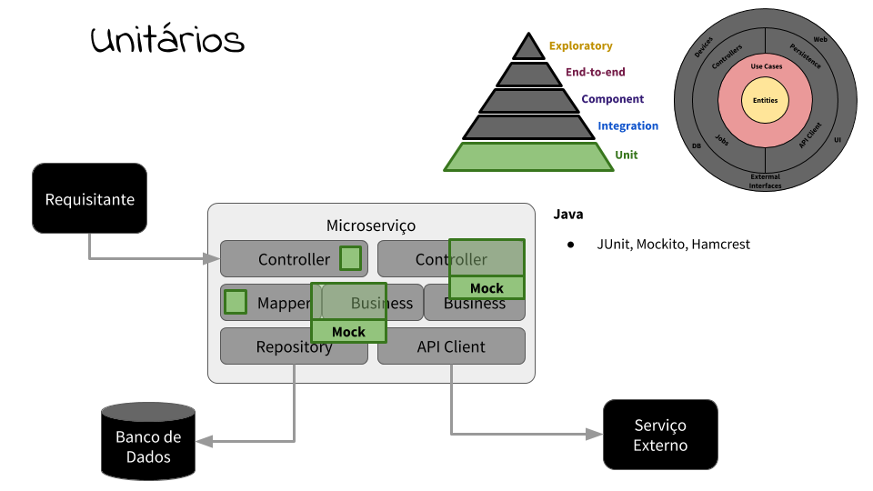
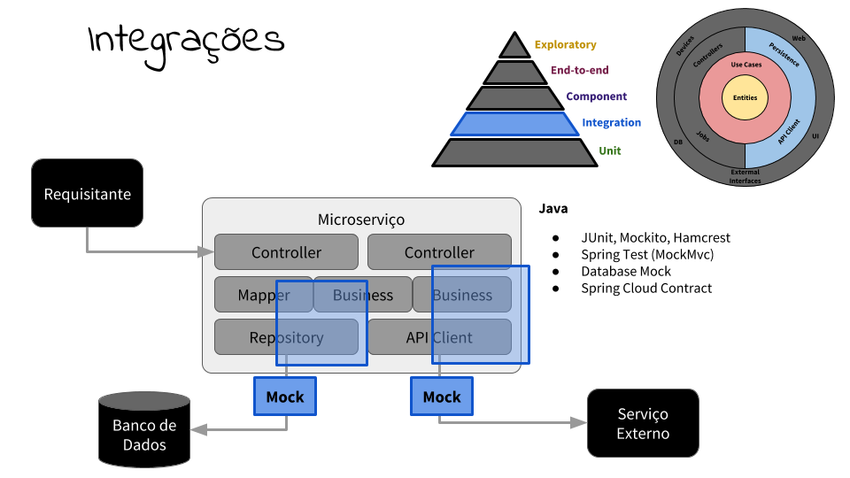
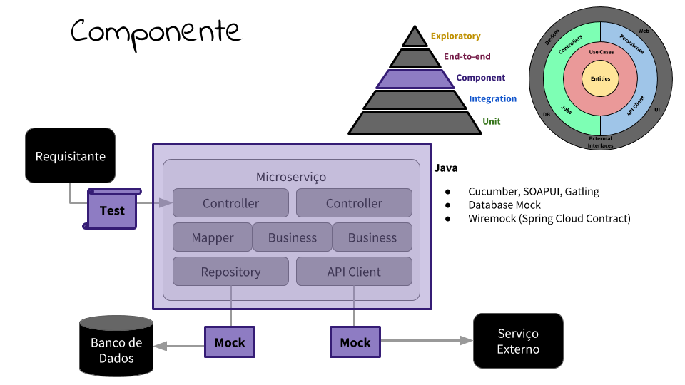
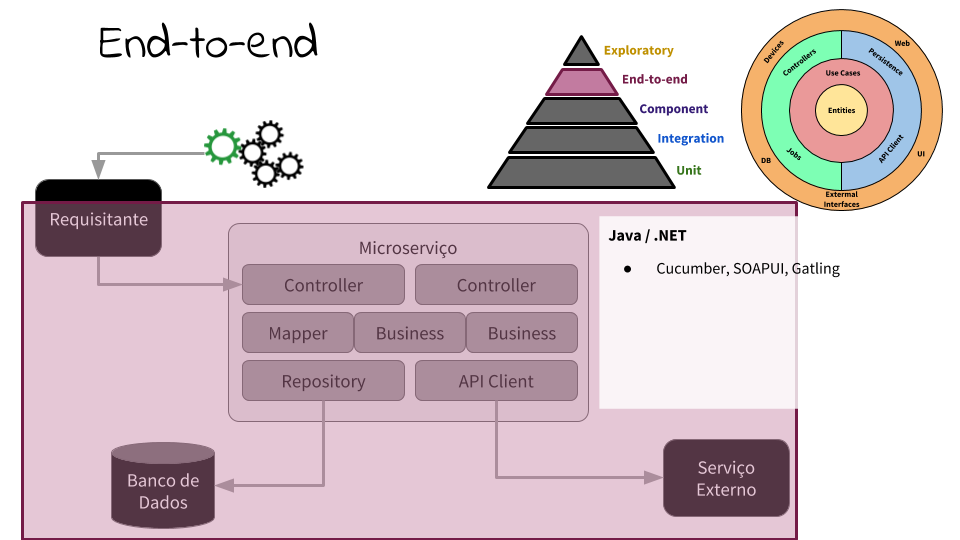
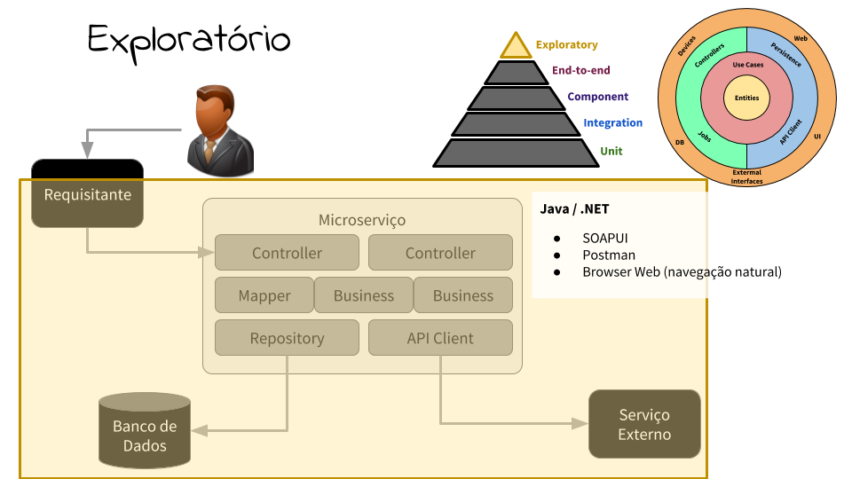

# test-pyramid
Simple project to apply Test Pyramid methodology together with Clean Architecture

There are some code samples showing how to test on each layer of the pyramid, from bottom to top, and how each layer exercises a real component or use an emulated one:

--- 

### 5th layer - Unit Tests

**The Business Class (or Utility Class) to be tested has all its internal objects emulated with a Mock instance (expected input and output defined on Test Class), and widely tested to cover all input variations and expected results. Examples:**
* [BookCreateUseCaseTest.java](pyramid-microservice/src/test/java/com/github/ricardocomar/testpyramid/microservice/book/usecase/BookCreateUseCaseTest.java)
* [BookEntityMapperTest.java](pyramid-microservice/src/test/java/com/github/ricardocomar/testpyramid/microservice/book/mapper/BookEntityMapperTest.java)

--- 

### 4th layer - Integration

**The Business Class to be tested has all its Integration Resorces (Data Provider, or even a External Resource Client) executed with the _real_ instances, and the final resource emulated with an on-memory database (like [H2](http://www.h2database.com)) initialized right before the Test, and discarded at end, or emulated with a [WireMock](http://wiremock.org) instance with expected requests and payloads.**
**In this layer the tests have less scenarios, only covering the external resource's variations. Examples:**
* [BookCreateDataProviderTest.java](pyramid-microservice/src/test/java/com/github/ricardocomar/testpyramid/microservice/book/dataprovider/BookCreateDataProviderTest.java)

--- 

### 3rd layer - Component

**The role application is tested calling all it's entrypoints, but still emulating external resources (like example above).**
**In this layer the tests have fewer scenarios, only covering the entrypoints input and output variations. Examples:**
* **Microservice**
    * [BookCreateEndpointTest.java](pyramid-microservice/src/test/java/com/github/ricardocomar/testpyramid/microservice/book/entrypoint/BookCreateEndpointTest.java)
    * [BookFindEndpointTest](pyramid-microservice/src/test/java/com/github/ricardocomar/testpyramid/microservice/book/entrypoint/BookFindEndpointTest.java)
* **Spring Cloud Contract**
    * [BookFindEntrypointTest.class](pyramid-frontend/src/test/java/com/github/ricardocomar/testpyramid/frontend/entrypoint/BookFindEntrypointTest.java)
* **Wiremock**
    * [BookCreateEntrypointTest.java](pyramid-frontend/src/test/java/com/github/ricardocomar/testpyramid/frontend/entrypoint/BookCreateEntrypointTest.java)

--- 

### 2nd layer - End-to-End

**The role application is tested in a dedicated environment, where all external resources are real, most similar to production environment as it's possible.**
**In this layer the tests are still made with an automated tool, but only cover the scenarios where the data has a state.**

--- 

### 1st layer - Exploratory

**The role application is tested in a dedicated environment, where all external resources are real, most similar to production environment as it's possible.**
**In this layer the tests are usualy made by a human, on pre-defined scenarios based on final user experience.**

--- 

### References
* <https://martinfowler.com/articles/microservice-testing/#conclusion-summary>
* <https://martinfowler.com/bliki/TestPyramid.html>
* <https://docs.spring.io/spring/docs/current/spring-framework-reference/testing.html>
* **Unit Testing**:
    * <https://junit.org/junit5/>
    * <http://hamcrest.org/JavaHamcrest/>
    * <http://site.mockito.org/> 
* <https://cloud.spring.io/spring-cloud-contract/>
* <https://reflectoring.io/consumer-driven-contract-consumer-spring-cloud-contract/>
* **Component and Integration Testing**:
    * <http://wiremock.org/docs/junit-rule/>
    * <http://wiremock.org/docs/stubbing/> 
* <https://gatling.io/docs/current/>
