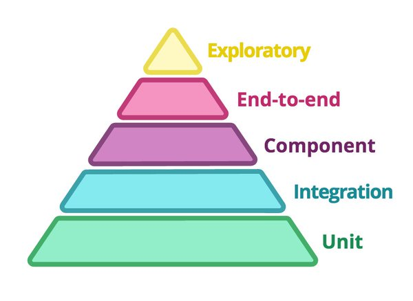

# test-pyramid
Simple project to apply Test Pyramid methodology together with Clean Architecture

### References
* <https://martinfowler.com/articles/microservice-testing/#conclusion-summary>
* <https://martinfowler.com/bliki/TestPyramid.html>
* <https://docs.spring.io/spring/docs/current/spring-framework-reference/testing.html>
* **Unit Testing**:
    * <https://junit.org/junit5/>
    * <http://hamcrest.org/JavaHamcrest/>
    * <http://site.mockito.org/> 
* <https://cloud.spring.io/spring-cloud-contract/>
* <https://reflectoring.io/consumer-driven-contract-consumer-spring-cloud-contract/>
* **Component and Integration Testing**:
    * <http://wiremock.org/docs/junit-rule/>
    * <http://wiremock.org/docs/stubbing/> 
* <https://gatling.io/docs/current/>
